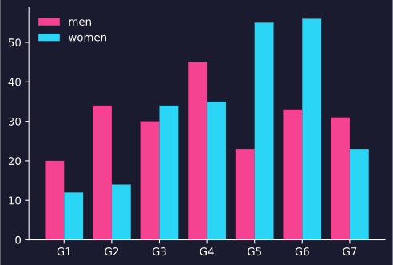

<p align= "right">
    <a href = "https://github.com/DarleySoares/Data-Science/blob/master/DataViz/Interfaces/README.md"></a>
    <a href = "https://github.com/DarleySoares/Data-Science/blob/master/DataViz/Interfaces/README_ENG.md"></a>
 </p1>


# Título

O módulo oferece gráficos personalizados que foram desenvolvidos utilizando o pacote matplotlib. Para os gráficos existem algumas possibilidades de personalização do usuário, como por exemplo a seleção da paleta de cores.

Para utilizar o módulo é necessário adiciona-lo à pasta do projeto e passar os parâmetros das personalizações que desejar. Caso essas não sejam passadas, serão utilizadas as pré configuradas.

**background** = cor do fundo (string da cor no formato hexadecimal)

**auxiliary_background** = cor auxiliar para fundo de gráficos (string da cor no formato hexadecimal)

**auxiliary_background** = cor auxiliar para fundo de gráficos (string da cor no formato hexadecimal)

**colors** = paleta de cores (lista de strings das cores no formato hexadecimal)

**color_labels** = cor utilizada para eixos, labels e grades (string da cor no formato hexadecimal)

```python
import module

# definindo um objeto da classe
obj = module.dataviz(
    background  = '#1B1B2F', auxiliary_background ='#22223D',
    colors = ['#F54291','#2AD5F5','#F5E55B','#A81D59','#2594A8'],
    color_labels = '#FFFFFF') 
```

## Visualizações

* [Gráfico de Linhas](#gráfico-de-linhas)
* [Gráfico de barras](#gráfico-de-barras)
* [Gráfico de progresso](#gráfico-de-progresso)
* [Gráfico de barras horizontais](#gráfico-de-barras-horizontais)

## Gráfico de linhas

No gráfico de linhas é possível plotar n linhas no mesmo eixo. Os parâmetros que podem ser configurados são:

| Parâmetros | Descrição   | Tipo |
|:----------:|:-----------:|:----:|
|x| valores de x| lista
|y| valores de y| lista
|legend| legenda| lista
|axes| lista com os eixos desejados| lista
|axes_labels| lista com quais eixos devem ter labal| lista
|grid| plota ou não as grades| booleano

```python
obj.line_chart(x = x, y = y, legend = ['line 1', 'line 2','line 3'], axes = ['bottom', 'left'], axes_labels = ['x', 'y'], grid = False)
```


## Gráfico de barras

No gráfico de barras é possível plotar n grupos com n barras. Os parâmetros que podem ser configurados são:

| Parâmetros | Descrição   | Tipo |
|:----------:|:-----------:|:----:|
|labels| categorias| lista
|values| valores das categorias| lista
|legend| legenda| lista
|axes| lista com os eixos desejados| lista
|axes_labels| lista com quais eixos devem ter labal| lista
|grid| plota ou não as grades| booleano

```python
obj.bar_chart(labels = labels, values = [men,women], legend = ['men','women'], axes = ['bottom', 'left'], axes_labels = ['x', 'y'] True, grid = False)
```



## Gráfico de progresso

No gráfico de progresso é inserido um círculo com a progresso informadas. É possível inserir mais de 1 círculo somente com intuito gráfico. Os parâmetros que podem ser configurados são:

| Parâmetros | Descrição   | Tipo |
|:----------:|:-----------:|:----:|
|value| valor do progresso| float
|circle| número de círculos| int

```python
obj.plot_progress(78,4)
```


## Gráfico de barras horizontais

No gráfico de barras horizontais é possível plotar n barras, à esquerda do gráfico é informado grupo e valor. Os parâmetros que podem ser configurados são:

| Parâmetros | Descrição   | Tipo |
|:----------:|:-----------:|:----:|
|labels| categorias| lista
|values| valores das categorias| lista

```python
obj.plot_horizontal_bar(['C1', 'C2', 'C3', 'C4', 'C5'],[15, 40, 20,70, 20])
```

