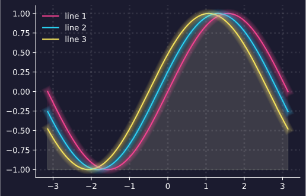
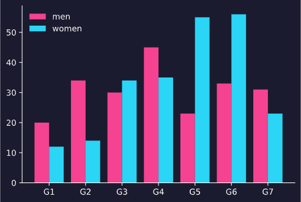
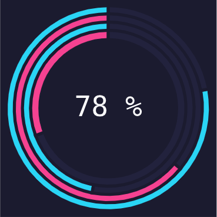
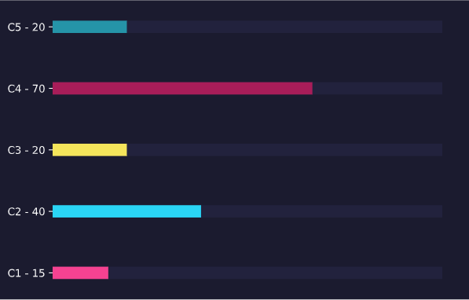

<p align= "right">
    <a href = "https://github.com/DarleySoares/Data-Science/blob/master/Projects/DataViz/pystaticplot/README.md"></a>
    <a href = "https://github.com/DarleySoares/Data-Science/blob/master/Projects/DataViz/pystaticplot/README_ENG.md"></a>
 </p1>
 
 
# Pystaticplot

The module offers custom graphics that were developed using the matplotlib package. For graphics there are some possibilities for user customization, such as selecting the color palette.

To use the module, you need to add it to the project folder and pass the parameters of the customizations you want. If these aren't informed, the pre defined ones 'll be used.

**background** = background color (color in hex format)

**auxiliary_background** = auxiliary color for backgrounds (color in hex format)

**colors** = color palette (color list in hex format)

**color_labels** = color used for axes, labels and grids (color in hex format)

```python
import pystaticplot

# defines an object of the class
obj = pystaticplot.dataviz(
    background  = '#1B1B2F', auxiliary_background ='#22223D',
    colors = ['#F54291','#2AD5F5','#F5E55B','#A81D59','#2594A8'],
    color_labels = '#FFFFFF') 
```

## Visualizations

* [Lines chart](#lines-chart)
* [Bars chart](#bars-chart)
* [Progress doughnut chart](#progress-doughnut-chart)
* [Horizontal bars chart](#horizontal-bars-chart)

## Lines chart

In the lines chart it's possible to plot n lines on the same axis. The parameters than can be configured are:
 
| Parameters | Description | Type |
|:----------:|:-----------:|:----:|
|x| x values| list
|y| y values| list
|legend| subtitles list| list
|axes| list with the axes| list
|axes_labels| x label and y label| list
|grid| plot or not the grids| boolean

```python
obj.line_chart(x = x, y = y, legend = ['line 1', 'line 2','line 3'], axes = ['bottom', 'left'], axes_labels = ['x', 'y'], grid = False)
```



## Bars chart

In the bars chart it's possible to plot n groups with n bars. The parameters than can be configured are:

| Parameters | Description | Type |
|:----------:|:-----------:|:----:|
|labels| labels| list
|values| values of labels| list
|legend| subtitles list| list
|axes| list with the axes| list
|axes_labels| x label and y label| list
|grid| plot or not the grids| boolean

```python
obj.bar_chart(labels = labels, values = [men,women], legend = ['men','women'], axes = ['bottom', 'left'], axes_labels = ['x', 'y'] True, grid = False)
```



## Progress doughnut chart

In the progress doughnut chart a circle with the reported progress is inserted. It's possible to insert other circles only with graphic intuition. The parameters that can be configured are:

| Parameters | Description | Type |
|:----------:|:-----------:|:----:|
|value| value of progress| float
|circles| number of circles| int

```python
obj.plot_progress(78,4)
```



## Horizontal bars chart

In the horizontal bar graph it's possible to plots n bars, to the left of the graph the group and the value are shown. The parameters than can be configured are:

| Parameters | Description | Type |
|:----------:|:-----------:|:----:|
|labels| labels| list
|values| values of labels| list

```python
obj.plot_horizontal_bar(['C1', 'C2', 'C3', 'C4', 'C5'],[15, 40, 20,70, 20])
```

